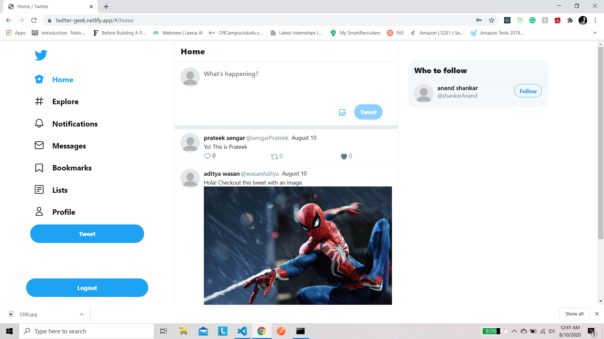

# Twitter Clone Frontend

Twitter clone built using React, Redux.

Demo - [https://twitter-geek.netlify.app/](https://twitter-geek.netlify.app/)

Backend Repository - [https://github.com/RisingGeek/twitter-clone-backend](https://github.com/RisingGeek/twitter-clone-backend)

## Features

1. Signup/Login
2. Add Tweet
3. Follow people
4. Like, Retweet, comment
5. View profile
6. Search users in explore section
7. Add bookmarks

## Upcoming Features

1. Notifications
2. Live updations of like, retweet

## Run locally

- Create a .env.development file with the following contents:

```javascript
    REACT_APP_SERVER_URL=[http://localhost:5000](http://localhost:5000)
    REACT_APP_SECRET_KEY=<YOUR_SECRET_KEY>
```

- `npm install && npm start`

## Demo


